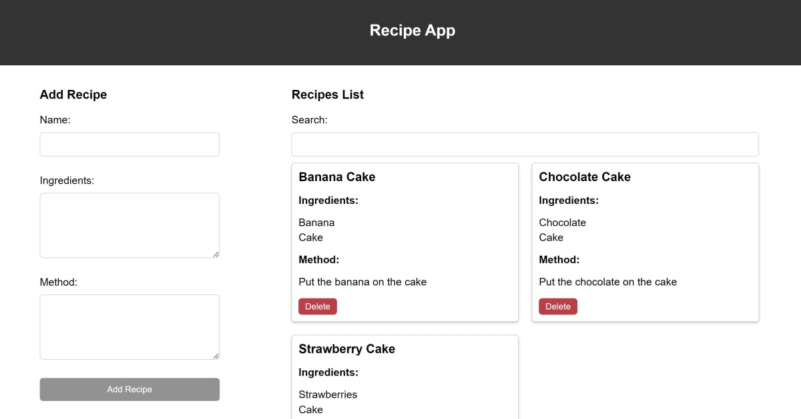

# JS-Recipe-Book
This is a project in HTML, CSS, and JS for a recipe book.

In the recipe book example, you can:
* Add recipes
* View the recipes list
* Delete recipes
* Search for recipes

# To Run

* Open the recipe-book folder
* Open index.html to view it in the browser

# Example

